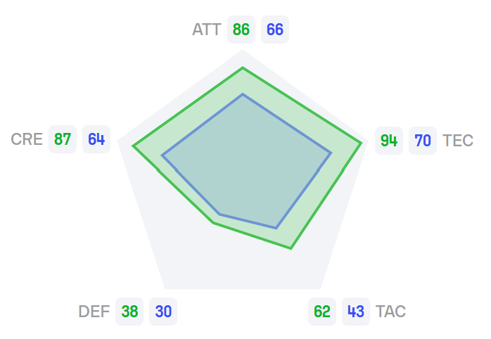

These projects were made in response to a problem whereby my sofascore requests were returning a 403 
error if I hit the API too many times in a day.

# Possible Finishes:

Relatively simple script to determine the possible finishing positions of every team in a league, 
given the league name. In the beginning, the program asks the user if they would like to use caching,
skip the caching and fetch from the website, or use a pre-prepared dataset from the premier league.
I added the last option because if the season is finished, it's just going to output the final 
league positions as the possible finishing positions, which is pointless. So this last option is for 
during the summer when there are no leagues playing. The program then outputs what the league table 
looks like currently, with a separate column showing the teams' finishing position ranges:

```
Pos Team                   Points GD   GS   GP   Possible Finishes
1   Liverpool              79     44   75   33   1-2              
2   Arsenal                67     34   63   34   1-7              
3   Newcastle United       62     21   65   34   2-10             
4   Manchester City        61     23   66   34   2-10             
5   Chelsea                60     19   59   34   2-11             
6   Nottingham Forest      60     14   53   33   2-11             
7   Aston Villa            57     5    54   34   2-12             
8   Fulham                 51     4    50   34   3-15             
9   Brighton & Hove Albion 51     1    56   34   3-15             
10  Bournemouth            49     12   52   33   3-16             
11  Brentford              46     6    56   33   4-17             
12  Crystal Palace         45     -4   43   34   7-17             
13  Wolverhampton          41     -10  51   34   8-17             
14  Everton                38     -7   34   34   10-17            
15  Manchester United      38     -8   38   33   8-17             
16  Tottenham Hotspur      37     10   61   33   8-17             
17  West Ham United        36     -19  39   34   11-17            
18  Ipswich Town           21     -41  33   34   18-20            
19  Leicester City         18     -49  27   34   18-20            
20  Southampton            11     -55  25   34   18-20            
```

(this is the data from the premier league on the 26th of April 2025)

Columns are: Current position, team name, points, goal difference, goals scored, games played, and 
the possible finishing positions.

The program works by finding teams which are currently below the selected team, teams which are 
currently above the selected team, and teams which are irrelevant to the selected team (teams which 
either can't overtake or be overtaken by the selected team). Then, to find the team's highest 
possible finishing position, it simulates the remaining games with teams above the selected team 
losing all their games, and teams below the selected team winning all their games. To make up for 
any differences in goal difference making an effect, the simulation makes winning teams win by the 
largest winning margin in premier league history (9–0). For matches between teams which are either 
both above or both below the selected team, it simulates every possible outcome and then finds 
the maximum finishing position. This whole process is then repeated to find the lowest possible
finishing position, but the other way round.

Finally, to get the final league table, this is done on all the teams in the league.

In the future I would like to change the part where if the season is not finished, the user has to 
manually input the number of rounds played. Automating this would mean not using the caching for 
this bit of code because the number of rounds played will change regularly.

# Similar Profiles:

Again, this is a very simple project which utilises sofascore's "attribute pentagons" to find 
players with similar profilesto a selected player.

The program first asks the user whether they would like to use caching. It then asks for the 
player who they would like to compare with other players. It then asks the user for a league to 
compare the players from, getting all the information of players from that league, including their 
attribute pentagon. The program converts each pentagon into five numerical values representing the
attributes: attacking, creativity, defending, tactical, and technical. To compare two players, the 
program first normalizes the example player's attributes so that their total matches that of the
target player. This is done by scaling each of the example player's attributes proportionally. 
Once normalized, the program calculates the squared difference between each corresponding attribute 
and sums them to produce a single "residual" score. The lower this residual, the more similar the 
example player is to the target. By doing it this way it finds the player whose pentagon is the 
most similar in shape without taking into account the size of the pentagon. The program then 
outputs the top 10 players with the most similar profiles to the selected player. This example is 
finding players from the premier league who are similar in profile to Lamine Yamal:

```
1st Closest Player: Noni Madueke, Residuals: 31.4
2nd Closest Player: Eberechi Eze, Residuals: 61.1
3rd Closest Player: Ross Barkley, Residuals: 74.5
4th Closest Player: Marcus Rashford, Residuals: 77.8
5th Closest Player: John McGinn, Residuals: 97.1
6th Closest Player: Callum Hudson-Odoi, Residuals: 102.9
7th Closest Player: Willian, Residuals: 110.0
8th Closest Player: Bukayo Saka, Residuals: 115.1
9th Closest Player: Cody Gakpo, Residuals: 119.0
10th Closest Player: Marco Asensio, Residuals: 119.9
```

Although the program is only using 5 numbers, I think this has worked quite well because it has 
mainly returned wingers, or other very technically minded players. This could potentially be used to 
find replacements for players who are aging or on their way out, with players from leagues which are 
maybe undervalued in the transfer market. Another way this could potentially be used is to see how 
rare aplayer's profile is. For example, if you run the program and all of the returned residuals are 
very high, it could mean that the player has a unique profile.

Below is a screenshot from sofascore's "compare attribute penetagons" feature, comparing Lamine
Yamal (green) with Noni Madueke (blue). I think that this shows that the pentagons have similar
shapes, even though the sizes are different because of the different skill levels of the players:



# Average Form:

This script is based off the idea that in a league season, everyone plays the same teams but it's
possible that, by chance, you'll play more teams that are in good form than bad form. for example,
lets say Team A plays Team B twice in a season, at the beginning and at the end, but Team C plays 
Team B twice in the middle of the season. It's possible that Team B are in good form at the
beginning of the season, hit a bad spell in the middle, and then get back to good form at the end.
Then, even though Team A and Team C have played the same team, Team A's fixture list is harder because
they had to play Team B when they were in good form, than Team C who played them when they were in bad
form.

This program uses the sofascore feature where you can see a team's form in the leadup to a certain
fixture, for example it may show [WDWLD], implying that the team's last results were win, draw,
win, loss, draw, and then the upcoming fixture. The program uses this to find the average points
per game in the last 5 games for their opposition, for each team in the league. It then prints
the results for all the teams in the league, sorted by the highest average points per game against.

An example of what this looks like is below:

```
Leeds United: 1.53 (45 games included)
Burnley: 1.48 (45 games included)
Norwich City: 1.47 (45 games included)
Derby County: 1.46 (45 games included)
Preston North End: 1.45 (45 games included)
Sunderland: 1.43 (44 games included)
Plymouth Argyle: 1.41 (45 games included)
Millwall: 1.40 (45 games included)
Watford: 1.37 (45 games included)
Blackburn Rovers: 1.37 (45 games included)
Swansea City: 1.37 (45 games included)
Luton Town: 1.36 (45 games included)
Sheffield United: 1.35 (45 games included)
Coventry City: 1.34 (45 games included)
West Bromwich Albion: 1.33 (45 games included)
Queens Park Rangers: 1.32 (45 games included)
Stoke City: 1.32 (45 games included)
Hull City: 1.31 (45 games included)
Sheffield Wednesday: 1.31 (45 games included)
Bristol City: 1.30 (45 games included)
Oxford United: 1.28 (45 games included)
Portsmouth: 1.28 (45 games included)
Cardiff City: 1.18 (45 games included)
Middlesbrough: 1.16 (44 games included)
```

This is the data from the 24/25 championship season. The reason for the discrepancy in the number of
games included is because occaisionally, sofascore will not include the recent form of the teams, for
some reason. Although this only happened once all season in Middlesborough vs Sunderland, so it may
be a once-off. Also the reason that the usual number of games included is 45 and not 46 (which is the
number of rounds) is because there is obviously no recent form data for the first game of the
season, so I've omitted it. This is a bit of a problem because it means that the results may be
slightly skewed, depending on the fixture list. Another issue that I may address in the future
is that the program does not currently give more weight to more recent fixtures, for example if a
team is playing Liverpool and their recent form is LWWWW, it has the same value as if it was WWWWL,
even though in the second example the loss is more recent, so it may be more relevant.

In the future I may also add a feature where the overall average of the whole league is calculated,
and displayed alongside the list, to add some context to the results. There is probably a way of 
calculating this based on the draw rate in the league. (Update: there is, its 
(3 * (1 - draw_rate / 2) + draw_rate), which in my example = 1.36. I will add this soon)